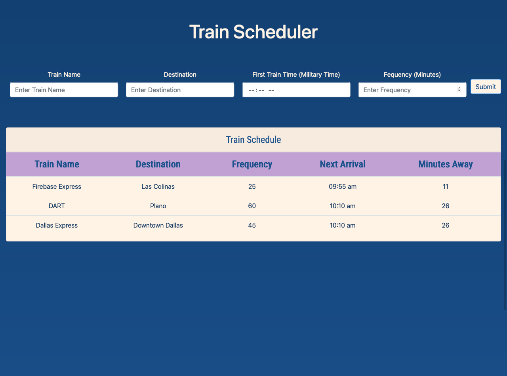

<!-- PROJECT LOGO -->

  <h1 align="center">Train Scheduler</h1>

  <p align="center">
    A CRUD Application hosted on Firebase
    <br />
    <br />
    <a href="https://train-schedule-eb0d7.firebaseapp.com/">View Demo</a>
  </p>
</p>


<!-- TABLE OF CONTENTS -->
<details open="open">
  <summary>Table of Contents</summary>
  <ol>
    <li>
      <a href="#about-the-project">About The Project</a>
      <ul>
        <li><a href="#built-with">Built With</a></li>
      </ul>
    </li>
    <li>
      <a href="#getting-started">Getting Started</a>
      <ul>
        <li><a href="#installation">Installation</a></li>
      </ul>
    </li>
    <li><a href="#contact">Contact</a></li>
    <li><a href="#acknowledgements">Acknowledgements</a></li>
  </ol>
</details>


<!-- ABOUT THE PROJECT -->
## About The Project
<br />

<br />
<br />


<br />
<br />

The purpose of this project was to utilize jQuery and MomentJS to track train schedules that the users would create.   


Objective and Summary:
* Give the user the ability to enter information for their train schedule.
* Prepend the information the user creates to table.
* The information is then stored on Firebases Cloud Storage. This allows the schedule to remain in place when then user comes back to the app.
* Based on the "Frequency" the user enters, MomentJS would then track time and provide the user information on when the next train would arrive.

### Built With

The following frameworks were used to complete the project.
* [HTML5](https://developer.mozilla.org/en-US/docs/Web/Guide/HTML/HTML5)
* [Bootstrap](https://getbootstrap.com)
* [JQuery](https://jquery.com)
* [MomentJS](https://momentjs.com/)
* [Firebase Database](https://firebase.google.com/docs/database)
* [Firebase Hosting](https://firebase.google.com/docs/hosting)


<!-- GETTING STARTED -->
## Getting Started

A live demo of the project and be accessed at this [link](https://train-schedule-eb0d7.firebaseapp.com/) or the respository can be cloned to a local machine.

### Installation

1. Clone the repository:
   ```sh
   git clone https://github.com/aamir-malik22188/Train-Schedule.git
4. Start Application


<!-- CONTACT -->
## Contact

Aamir Malik - Aamir22188@gmail.com

Twitter Handle - [@TheRealAamir](https://twitter.com/TheRealAamir)

Project Repository: https://github.com/aamir-malik22188/Train-Schedule


<!-- ACKNOWLEDGEMENTS -->
## Acknowledgements
* [HTML5](https://developer.mozilla.org/en-US/docs/Web/Guide/HTML/HTML5)
* [Bootstrap](https://getbootstrap.com)
* [JQuery](https://jquery.com)
* [MomentJS](https://momentjs.com/)
* [Firebase](https://firebase.google.com/)
* [SMU Bootcamp](https://techbootcamps.smu.edu/)


